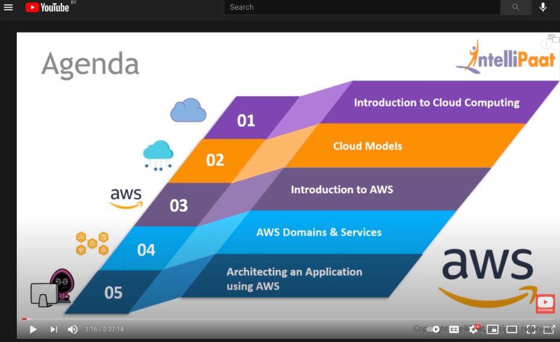
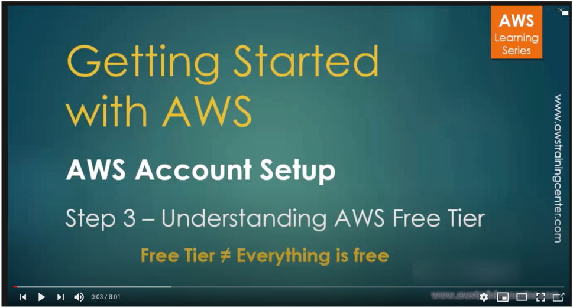
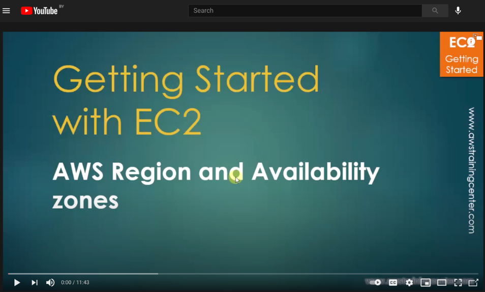
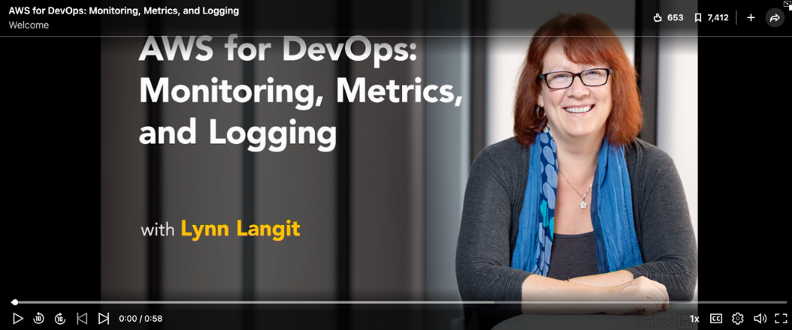
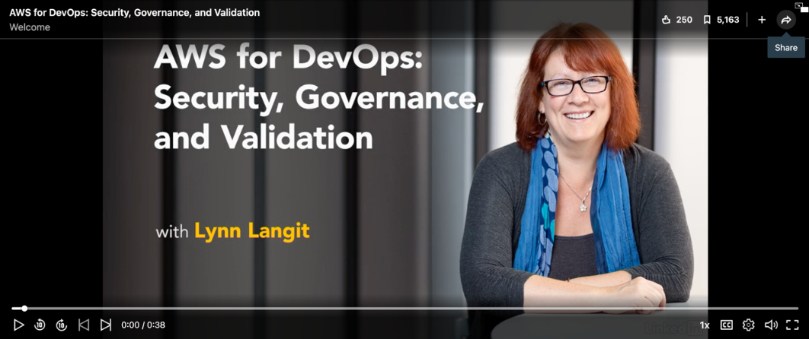
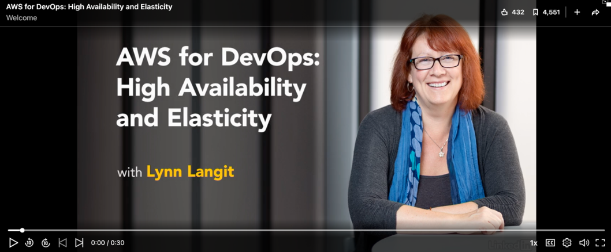
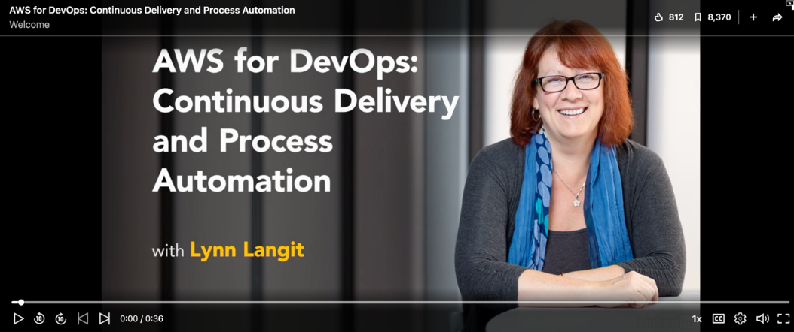
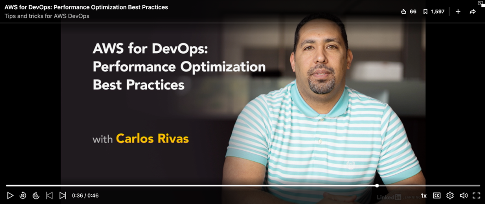

# ! DISCLAIMER

Despite the most of the labs in this course can be done using the AWS free tier, i.e. without any charging, there a couple of tasks that require creation of paid resources.
Resources like NAT Gateway, Route53 zone etc., will cost you some money (but not that much, fortunately). Anyway, before creating any type of resources, please be sure you carefully read and understood the appropriate pricing policy. Every type of resource is AWS has its own pricing page, for example [Route53 pricing](https://aws.amazon.com/route53/pricing/). If you cannot find the pricing policy in official AWS documentation, just google it, for example "NAT gateway pricing".
To avoid extra money expenditures, you can [set up a billing alert](https://docs.aws.amazon.com/AmazonCloudWatch/latest/monitoring/monitor_estimated_charges_with_cloudwatch.html) that will notify you immediately after you have reached some threshold in your billing.
And of course, do not forget cleaning up all the unnecessary resources after completing the lab.

# AWS Cloud Overview

## Introduction to AWS Services

#### AWS Tutorial for beginners:
- 

#### Understanding of free tier resources
- 

#### Understanding AWS Regions and Availability Zones
- 

#### AWS for DevOps: Monitoring, Metrics, and Logging (2h41m)
- 

#### AWS for DevOps: Security, Governance, and Validation (2h40m)
- 

#### AWS for DevOps: High Availability and Elasticity (2h33m)
- [)](https://www.linkedin.com/learning-login/share?account=2113185&forceAccount=false&redirect=https%3A%2F%2Fwww.linkedin.com%2Flearning%2Faws-for-devops-high-availability-and-elasticity%3Ftrk%3Dshare_ent_url%26shareId%3DgQyahK64RlioYS%252F5NJ8wgg%253D%253D)

#### AWS for DevOps: Continuous Delivery and Process Automation (2h2m)
- [)](https://www.linkedin.com/learning-login/share?account=2113185&forceAccount=false&redirect=https%3A%2F%2Fwww.linkedin.com%2Flearning%2Faws-for-devops-continuous-delivery-and-process-automation%3Ftrk%3Dshare_ent_url%26shareId%3D%252FmFJk%252BIMSviCdlev0m%252B19g%253D%253D)

#### AWS for DevOps: Performance Optimization Best Practices (1h19m)
- [)](https://www.linkedin.com/learning-login/share?account=2113185&forceAccount=false&redirect=https%3A%2F%2Fwww.linkedin.com%2Flearning%2Faws-for-devops-performance-optimization-best-practices%3Ftrk%3Dshare_ent_url%26shareId%3DNOFYQCLDQmqoSefKX2sZsA%253D%253D)

11.20

        
---

### AWS overview on practice example 
**Short overview** 
>Gives overview of AWS datacenter locations, definition of Regions and Availablity Zones, 
high level mentioning of AWS Services model and description of them based on Praclicale case with Social Media application

- [AWS Datacenters overview](https://youtu.be/Z3SYDTMP3ME?list=RDCMUC1Yf7IBfhSNFTIyb7v83o_g&t=17)
- [Regions and Availability zones](https://youtu.be/Z3SYDTMP3ME?list=RDCMUC1Yf7IBfhSNFTIyb7v83o_g&t=144)
- [AWS Account, Users and Services Scope](https://youtu.be/Z3SYDTMP3ME?list=RDCMUC1Yf7IBfhSNFTIyb7v83o_g&t=202)
- [AWS Services quick overview](https://youtu.be/Z3SYDTMP3ME?list=RDCMUC1Yf7IBfhSNFTIyb7v83o_g&t=336)
- [Practical example - build Social Media application with AWS Services](https://youtu.be/Z3SYDTMP3ME?list=RDCMUC1Yf7IBfhSNFTIyb7v83o_g&t=426)

---
Initial Plan for the reference
- AWS Fundamentals
- Regions and Zones
- Access and manage Amazon Web Services
- Protecting your AWS account
- Logging and Monitoring
- Taking care of Billing in Cloud

# Amazon Web Services
Amazon Web Services (AWS) is the world’s most comprehensive and broadly adopted cloud platform, offering over 200 fully featured services from data centers globally.
AWS has the most extensive global cloud infrastructure. No other cloud provider offers as many Regions with multiple Availability Zones connected by low latency, high throughput, and highly redundant networking. AWS has 80 Availability Zones within 25 geographic regions around the world, and has announced plans for 15 more Availability Zones and 5 more AWS Regions.

The platform is developed with a combination of infrastructure as a service (IaaS), platform as a service (PaaS) and packaged software as a service (SaaS) offerings.

**What are the services provided by AWS?**

Each type of service  is categorized under a domain:
- AWS Networking and Content Delivery services
- AWS Compute services
- AWS Storage services
- Database services
- Analytics 
- Developer Tools
- Management tools
- IoT
- Security
- Enterprise app

# AWS Networking and Content Delivery services

|Category|Service description|AWS service|
| :- | :- | :- |
|Network foundations|Define and provision a logically isolated network for your AWS resources|Amazon VPC|
||
Connect VPCs and on-premises networks through a central hub 

|AWS Transit Gateway|
||
Provide private connectivity between VPCs, services, and on-premises applications 

|AWS PrivateLink|
|Application networking|Automatically distribute traffic across a pool of resources, such as instances, containers, IP addresses, and Lambda functions|Elastic Load Balancing|
||Provide application-level networking for containers and microservices|AWS App Mesh|
||Create, maintain, and secure APIs at any scale|Amazon API Gateway|
|
Edge networking

|
Securely deliver data, videos, applications, and APIs to customers globally with low latency, and high transfer speeds 

|Amazon CloudFront|
||
Route users to Internet applications with a managed DNS service 

|Amazon Route 53|
||
Direct traffic through the AWS Global network to improve global application performance 

|AWS Global Accelerator|
|Network security|
Safeguard applications running on AWS against DDoS attacks 

|AWS Shield|
||
Protect your web applications from common web exploits 

|AWS WAF|
||
Centrally configure and manage firewall rules 

|AWS Firewall Manager|

## **AWS Compute services**

|Category|Service description|AWS service|
| :- | :- | :- |
|
Instances (Virtual machines) 

|Secure and resizable compute capacity (virtual servers) in the cloud|Amazon Elastic Compute Cloud (EC2)|
||Run fault-tolerant workload for up to 90% off|Amazon EC2 Spot Instances|
||Automatically add or remove compute capacity to meet changes in demand|Amazon EC2 Autoscaling|
||Easy-to-use cloud platform that offers you everything you need to build an application or website|Amazon Lightsail|
|Containers|Highly secure, reliable, and scalable way to run containers|Amazon Elastic Container Service (ECS)|
||Easily store, manage, and deploy container images|Amazon Elastic Container Registry (ECR)|
||Fully managed Kubernetes service|Amazon Elastic Kubernetes Service (EKS)|
||Serverless compute for containers|AWS Fargate|
|Serverless|Run code without thinking about servers. Pay only for the compute time you consume|AWS Lambda|

## **AWS Storage services**

|Category|Service description|AWS service|
| :- | :- | :- |
|
Object storage

|
Object storage built to store and retrieve any amount of data from anywhere

|
Amazon S3
|
|
File storage

|
Simple, serverless, set-and-forget, elastic file system

|
Amazon Elastic File System
|
||
Fully managed file storage built on Windows Server

|
Amazon FSx for Windows File Server

|
||Amazon FSx for Lustre is a fully managed service that provides cost-effective, high-performance, scalable storage for compute workload|
Amazon FSx for Lustre
|
|
Block storage
|Amazon Elastic Block Store (EBS) is an easy to use, high-performance, block-storage service|
Amazon Elastic Block Store
|

## **Database services**
##

|Category|Service description|AWS service|
| :- | :- | :- |
|Relational|Traditional applications, ERP, CRM, e-commerce|Amazon Aurora, Amazon RDS, Amazon Redshift|
|Key-value|High-traffic web apps, e-commerce systems, gaming applications|Amazon DynamoDB|
|In-memory|Caching, session management, gaming leaderboards, geospatial applications|Amazon ElastiCache for Memcached, Amazon ElastiCache for Redis|

## **AWS Security, Identity, & Compliance services**

|Category|Service description|AWS service|
| :- | :- | :- |
|
Identity & access management
|
Securely manage access to services and resources
|AWS Identity & Access Management (IAM)|
||Managed Microsoft Active Directory|AWS Directory Service|
||Identity management for your apps|Amazon Cognito|
|Detection|Managed threat detection service|Amazon GuardDuty|
||Analyze application security|Amazon Inspector|
||Record and evaluate configurations of your AWS resources|AWS Config|
||Track user activity and API usage|AWS CloudTrail|
|Data protection|Key storage and management|AWS Key Management Service (KMS)|
||Hardware based key storage for regulatory compliance|AWS CloudHSM|
||Provision, manage, and deploy public and private SSL/TLS certificates|AWS Certificate Manager|
||Rotate, manage and retrieve secrets|AWS Secrets Manager|

