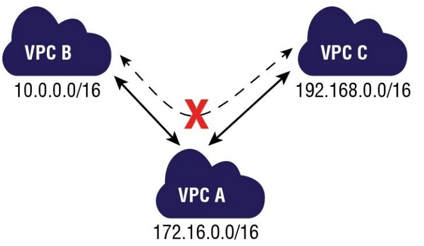

# Peering

An Amazon VPC peering connection is a networking connection between two Amazon VPCs that enables instances in either Amazon VPC to communicate with each other as if they are within the same network. You can create an Amazon VPC peering connection between your own Amazon VPCs or with an Amazon VPC in another AWS account within a single region. A peering connection is neither a gateway nor an Amazon VPN connection and does not introduce a single point of failure for communication. 

Peering connections are created through a request/accept protocol. The owner of the requesting Amazon VPC sends a request to peer to the owner of the peer Amazon VPC. If the peer Amazon VPC is within the same account, it is identified by its VPC ID. If the peer VPC is within a different account, it is identified by Account ID and VPC ID. The owner of the peer Amazon VPC has one week to accept or reject the request to peer with the requesting Amazon VPC before the peering request expires.

An Amazon VPC may have multiple peering connections, and peering is a one-to-one
relationship between Amazon VPCs, meaning two Amazon VPCs cannot have two peering
agreements between them. Also, peering connections do not support transitive routing.

### VPC peering connections do not support transitive routing:

In this figure, VPC A has two peering connections with two different VPCs: VPC B and VPC C. Therefore, VPC A can communicate directly with VPCs B and C. Because peering connections do not support transitive routing, VPC A cannot be a transit point for traffic between VPCs B and C. In order for VPCs B and C to communicate with each other, a peering connection must be explicitly created between them.

Here are the important points to understand about peering for the exam:

- You cannot create a peering connection between Amazon VPCs that have matching or overlapping CIDR blocks.
- You cannot create a peering connection between Amazon VPCs in different regions.
- Amazon VPC peering connections do not support transitive routing.
- You cannot have more than one peering connection between the same two Amazon VPCs at the same time.

