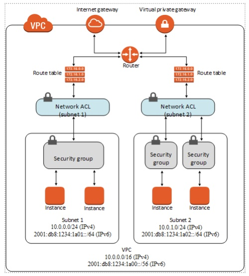

# VPC Security 

Amazon Virtual Private Cloud provides features that you can use to increase and monitor the security for your virtual private cloud (VPC): 

- A **security group** acts as a virtual firewall for your instance to control inbound and outbound traffic. When you launch an instance in a VPC, you can assign up to five security groups to the instance. Security groups act at the instance level, not the subnet level. Therefore, each instance in a subnet in your VPC can be assigned to a different set of security groups. For each security group, you add rules that control the inbound traffic to instances, and a separate set of rules that control the outbound traffic.. Security Groups are Stateful if you send a request from your instance, the response traffic for that request is allowed to flow in regardless of inbound security group rules. Responses to allowed inbound traffic are allowed to flow out, regardless of outbound rules.;  

- A **network access control list (ACL)** is an optional layer of security for your VPC that acts as a firewall for controlling traffic in and out of one or more subnets. You might set up network ACLs with rules similar to your security groups in order to add an additional layer of security to your VPC.  Network Access Control Lists are Stateless, which means that responses to allowed inbound traffic are subject to the rules for outbound traffic (and vice versa).  

The following diagram illustrates the layers of security provided by security groups and network ACLs. For example, traffic from an internet gateway is routed to the appropriate subnet using the routes in the routing table. The rules of the network ACL that is associated with the subnet control which traffic is allowed to the subnet. The rules of the security group that is associated with an instance control which traffic is allowed to the instance:

## Difference between Security Group and ACL:

| Security Group | ACL |
|---|---|
| Operates at the instance level (first layer of defense) | Operates at the subnet level (second layer of defense) |
| Supports "allow" rules only | Supports allow rules and deny rules |
| Stateful: Return traffic is automatically allowed, regardless of any rules | Stateless: Return traffic must be explicitly allowed by rules. |
| AWS evaluates all rules before deciding whether to allow traffic | AWS processes rules in number order when deciding whether to allow traffic. |
| Applied selectively to individual instances | Automatically applied to all instances in the associated subnets; this is a backup layer of defense, so you don’t have to rely on someone specifying the security group |

## Cautions 

- Network ACLs per VPC - `2000`. You can associate one network ACL to one or more subnets in a VPC. This quota is not the same as the number of rules per network ACL. 
- Rules per network ACL - `20`. This is the one-way quota for a single network ACL. This quota is enforced separately for IPv4 rules and IPv6 rules; for example, you can have 20 ingress rules for IPv4 traffic and 20 ingress rules for IPv6 traffic. This quota includes the default deny rules (rule number `32767` for IPv4 and `32768` for IPv6, or an asterisk * in the Amazon VPC console). 
- This quota can be increased up to a maximum of `40`; however, network performance might be impacted due to the increased workload to process the additional rules 
- VPC security groups per Region – `2500`. This quota applies to individual AWS account VPCs and shared VPCs. If you increase this quota to more than `5000` security groups in a Region, we recommend that you paginate calls to describe your security groups for better performance. 
- Inbound or outbound rules per security group – `60`.  You can have 60 inbound and 60 outbound rules per security group (making a total of 120 rules). This quota is enforced separately for IPv4 rules and IPv6 rules; for example, a security group can have 60 inbound rules for IPv4 traffic and 60 inbound rules for IPv6 traffic. A rule that references a security group or AWS-managed prefix list ID counts as one rule for IPv4 and one rule for IPv6. 
- A quota change applies to both inbound and outbound rules. This quota multiplied by the quota for security groups per network interface cannot exceed 1000. For example, if you increase this quota to 100, we decrease the quota for your number of security groups per network interface to `10`. 
- If you reference a customer-managed prefix list in a security group rule, the maximum number of entries for the prefix lists equals the same number of security group rules. 
- Security groups per network interface – `5`. The maximum is `16`. This quota is enforced separately for IPv4 rules and IPv6 rules. The quota for security groups per network interface multiplied by the quota for rules per security group cannot exceed `1000`. For example, if you increase this quota to `10`, we decrease the quota for your number of rules per security group to 100. 
 

## Pricing considerations 
- https://aws.amazon.com/vpc/pricing/ 

## More details 

- https://docs.aws.amazon.com/vpc/latest/userguide/security.html 