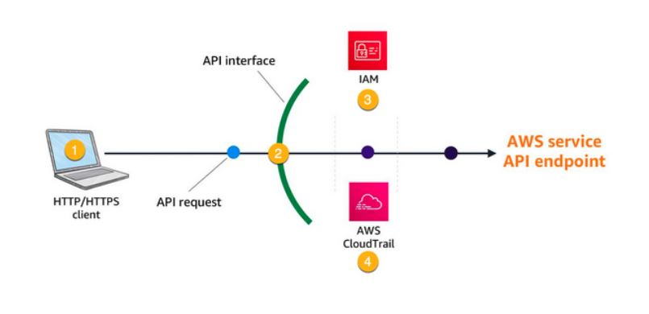
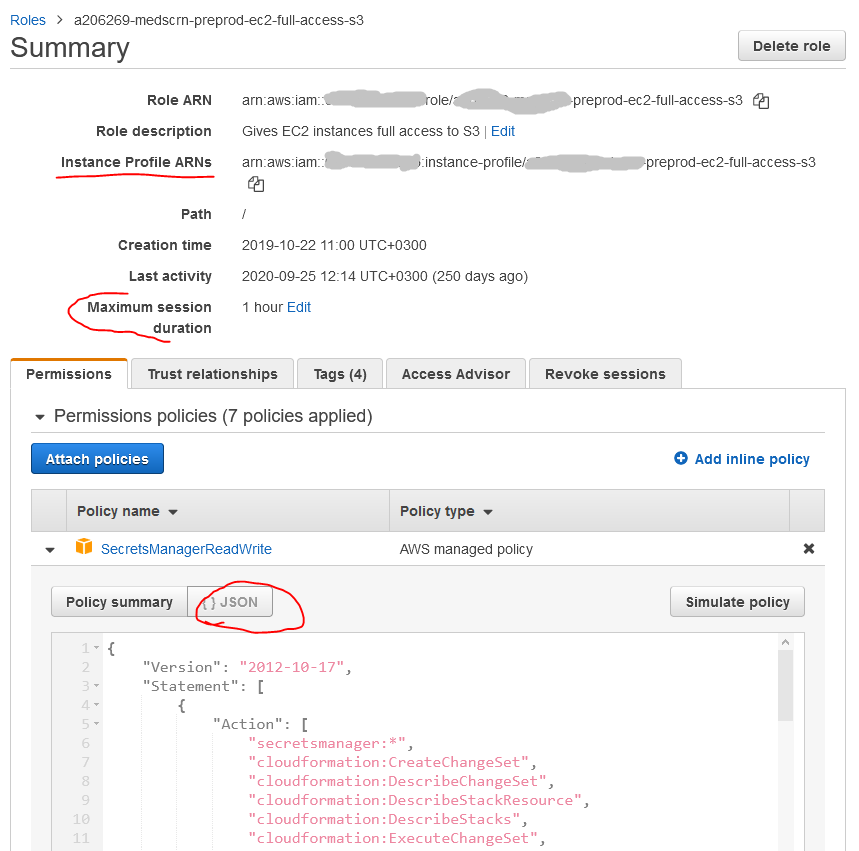

# IAM – Identity and Access Management

## Service Overview

---

AWS Identity and Access Management (IAM) helps you securely control access to Amazon Web Services (AWS) and your account resources. IAM can also keep your account credentials private. With IAM, you can create multiple IAM users under the umbrella of your AWS account or enable temporary access through identity federation with your corporate directory. In some cases, you can also enable access to resources across AWS accounts.

Without IAM, however, you must either create multiple AWS accounts—each with its own billing and subscriptions to AWS products—or your employees must share the security credentials of a single AWS account. In addition, without IAM, you cannot control the tasks a particular user or system can do and what AWS resources they might use.

Almost everything is tied with IAM in AWS!

## API request flow

Very important to understand that every interaction with AWS services is an request to API endpoint - create instance, run Lambda function or observe the billing. All of this availible throug API. Each request passing via HTTPS[1], validating on API endpoint[2], authenticated and authorized on IAM[3] and recording to CloudTrail[4] even the request was unsuccessful.

## Use cases / Considerations

---

* **Fine-grained access control to AWS resources** - IAM enables [your users](https://aws.amazon.com/iam/features/manage-users/) to [control access](https://aws.amazon.com/iam/features/manage-permissions/) to AWS service APIs and to specific resources. IAM also enables you to add [specific conditions](https://aws.amazon.com/iam/features/manage-permissions/) such as time of day to control how a user can use AWS, their originating IP address, whether they are using SSL, or whether they have authenticated with a [multi-factor authentication device](https://aws.amazon.com/iam/features/mfa/). IAM is secure by default; users have no access to AWS resources until permissions are explicitly granted.
* **Temporary credentials** - In addition to defining access permissions directly to users and groups, IAM lets you create roles. Roles allow you to define a set of permissions and then let authenticated users or EC2 instances assume them, increasing your security posture by granting temporary access to the resources you define.
* **Multi-factor authentication for highly privileged users** - protect your AWS environment by using [AWS MFA](https://aws.amazon.com/iam/features/mfa/), a security feature available at no extra cost that augments user name and password credentials. MFA requires users to prove physical possession of a hardware MFA token or MFA-enabled mobile device by providing a valid MFA code.
* **Analyze access** - IAM helps you [analyze access](https://aws.amazon.com/iam/features/analyze-access/) across your AWS environment. Your security teams and administrators can quickly validate that your policies only provide the intended public and cross-account access to your resources. You can also easily identify and refine your policies to allow access to only the services being used. This helps you to better adhere to the principle of least privilege.
* **Integrate with your corporate directory** - IAM can be used to grant your employees and applications [federated access](https://aws.amazon.com/identity/federation/) to the AWS Management Console and AWS service APIs, using your existing identity systems such as Microsoft Active Directory. You can use any [identity management](http://docs.aws.amazon.com/IAM/latest/UserGuide/IdP-solution-providers.html) solution that supports [SAML 2.0](https://aws.amazon.com/identity/saml/), or feel free to use one of our federation samples ([AWS Console SSO](http://aws.amazon.com/code/4001165270590826) or [API federation](http://aws.amazon.com/code/1288653099190193)).
* **Seamlessly integrated into AWS services** - IAM is integrated into most AWS services. This provides the ability to define access controls from one place in the AWS Management Console that will take effect throughout your AWS environment.

## Key points

---

* Policies are expressed in JSON [format](https://docs.aws.amazon.com/IAM/latest/UserGuide/reference_policies_grammar.html).
* Use an [instance profile](https://docs.aws.amazon.com/IAM/latest/UserGuide/id_roles_use_switch-role-ec2_instance-profiles.html) to pass an IAM role to an EC2 instance (see picture below).
* By default IAM role has "Maximum session duration" 1 hour, it could be changed, but not for role chaining using CLI or API.
* To configure many AWS services, you must [pass an IAM role to the service](https://docs.aws.amazon.com/IAM/latest/UserGuide/id_roles_use_passrole.html).
* Resource-based policies are attached to a resource. For example, you can attach resource-based policies to Amazon S3 buckets, Amazon SQS queues, and AWS Key Management Service encryption keys. For a list of services that support resource-based policies, see [AWS services that work with IAM](https://docs.aws.amazon.com/IAM/latest/UserGuide/reference_aws-services-that-work-with-iam.html).
  

## Cautions

---

* **Roles** and **policies** are global AWS resources, their **names** must be **unique across AWS account**. 

_**Hint**_: in some cross environment and/or regional cases you could add environment suffix (dev, qa, preprod, etc) and/or region name (f.i. us-east-1), short region name (use1).

## Pricing considerations

---
* There is no charge for IAM usage, it's free.

## More details

### Videos
* [IAM ninja (video)](https://www.youtube.com/watch?v=aISWoPf_XNE)
* [Become an IAM policy master in 60 minutes or less (video)](https://youtu.be/YQsK4MtsELU)

### Documentation
* [AWS IAM FAQs](https://aws.amazon.com/iam/faqs/)
* [Policy evaluation logic](https://docs.aws.amazon.com/IAM/latest/UserGuide/reference_policies_evaluation-logic.html)

### Recommended Trainings:

- [AWS Certified Solutions Architect - Associate (SAA-C02): 5 Identity and Access Management](https://learn.epam.com/detailsPage?id=711b13a6-3eba-4d0a-a87c-278c60661983&source=EXTERNAL_COURSE)

 
